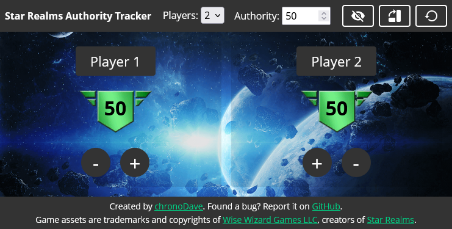
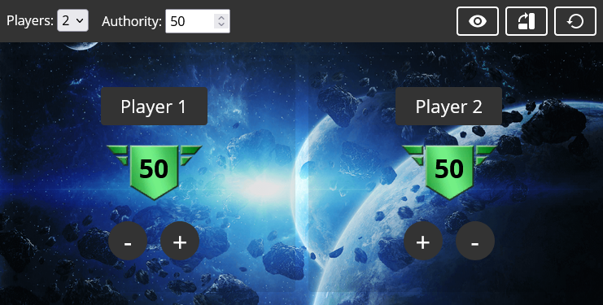
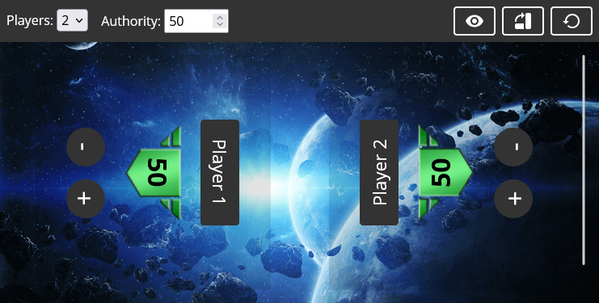

  
  <h1><a href="https://chronodave.github.io/star-realms-authority/">Star Realms Authority Tracker</a></h1>
  
An online authority tracker for the card deckbuilding game <a href="https://www.starrealms.com/">Star Realms</a>.

## Features

- **Mobile friendly**, track your authority as you go with **focus** and **mirror** mode.
- Can be used **offline** using [PWA](https://developer.mozilla.org/en-US/docs/Web/Progressive_web_apps/Installing) technology.
- Support **2 to 4** players.
- **Customizable authority points**, if you wish to player shorter or longer games.
- **Audio feedback**, adds that extra sweetness when dealing damage to your opponent. 

**Focus mode**

**Mirror mode**

